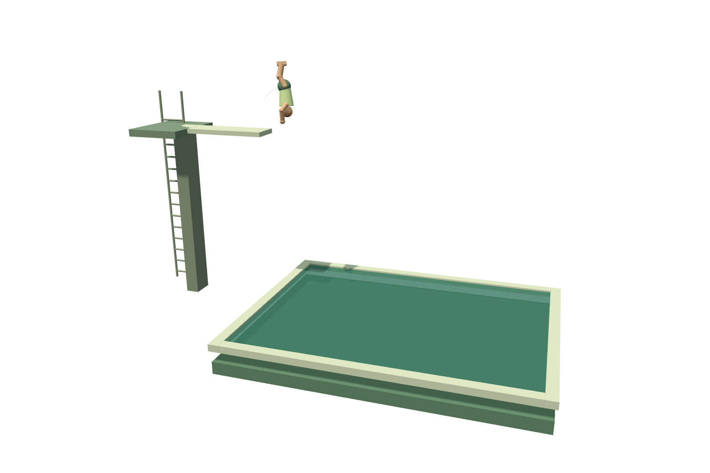
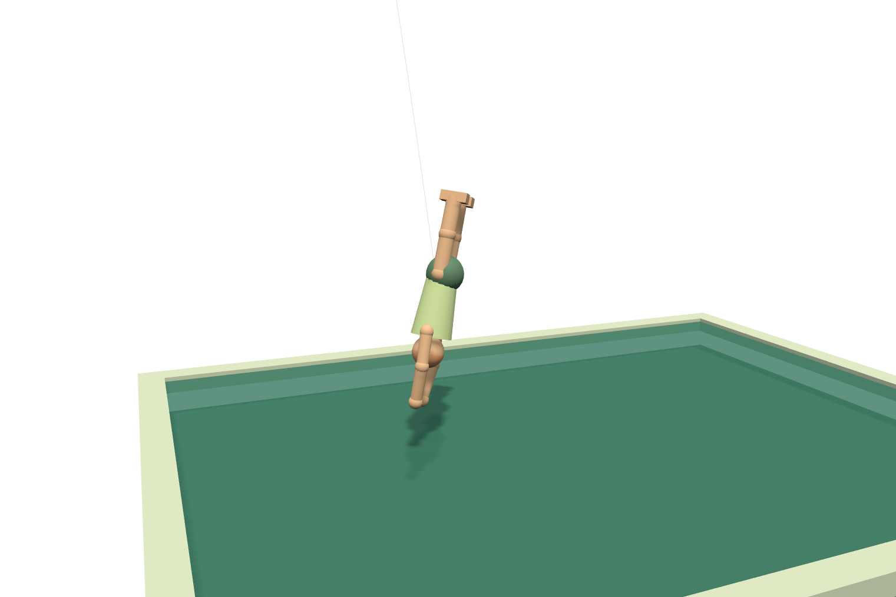

# Learn to Dive

A small, fully local experiment in reward-trained control. Raise a diving board, change the launch conditions, and replay a pretrained policy in a Three.js arena. Compare it with the actual initial weights and a simple analytic half-somersault baseline. No visitor training, remote inference, uploads, or API keys are involved.




## Run and embed

Requires Node 22 or later.

```sh
npm ci
npm run dev          # http://127.0.0.1:5184
npm run build
npm test
npm run test:browser # Playwright Chromium; npx playwright install chromium if needed
npm run capture
```

```js
import { mountExperiment, metadata } from '@zachshotamartin/learn-to-dive';
import '@zachshotamartin/learn-to-dive/style.css';

const experiment = mountExperiment(element, { embedded: true });
// Later, on navigation/unmount:
experiment.dispose();
```

The mount returns synchronously. `embedded: true` omits the standalone heading. CSS is scoped to `.learn-to-dive`; its preview and WebGL clear background are transparent. The host page's color or texture shows through. Model coefficients are small imported JavaScript assets; no `assetBase` copy or separate model fetch is required. The simulation worker is packaged using `new URL(..., import.meta.url)`.

Change board height, launch speed, crosswind, or measured takeoff lean. New takeoff introduces a deterministic new lean perturbation. Replay uses the same computed physical trajectory; it does not run training. Scrub to inspect any state, use quarter/half speed, toggle the trajectory and conserved momentum arrow, or choose an orbit/side view. Inspect entry scrubs near contact and frames the body closely. Export result downloads the completed trial's inputs, motor commands and full score breakdown as JSON.

## What actually learned

This is a **20-coefficient contextual motor policy optimized by cross-entropy policy search (CEM)**. It is not a neural network or a full humanoid controller. A population of coefficient matrices receives only rewards from complete simulated dives. The best-performing candidates update the search distribution. No expert labels, baseline trajectories, or analytic optimal actions are fitted into the learned model.

Five observed features (bias, inverse ballistic flight-time estimate, its square, measured takeoff lean, and launch velocity) produce four bounded commands: takeoff somersault impulse, takeoff twist impulse, tuck amount, and opening time as a fraction of estimated flight duration. The flight-time feature is a physical observation transform; the learned coefficients select the commands. The baseline is a separate explicitly analytic policy that attempts one straight half somersault.

Training uses 180 generations × 96 candidates × 48 varied contexts = **829,440 reward-evaluated training dives**. Checkpoint selection uses 384 separate validation contexts. Frozen `src/data/model.js` records the real coefficients, initial zero coefficients, training seed, evaluation counts, and validation history. The NumPy run took 40.81 seconds on an M3 Pro CPU; browser inference is four small dot products followed by a bounded trajectory in a worker.

The final policy typically learns 1½ somersaults with a partial or full twist. It tucks early and opens before entry. It is an open-loop motor program conditioned at takeoff, so it cannot recover from a new, unobserved midair disturbance. Crosswind is a known uniform force through the center of mass; the policy does not get a wind feature because this model gives it no lateral steering action.

## Measured evaluation

A separate 2,000-case test set (seed `990517`) samples board heights 2–12 m, vertical launch 1.5–3.5 m/s, uniform lateral acceleration ±0.6 m/s², and initial lean ±0.09 radians. These contexts are distinct from training and checkpoint selection. Results are from the frozen coefficients, with identical conditions for all three policies; invalid entries score zero.

| Policy | Valid entries | Mean score / 100 | Mean entry angle | Mean somersaults | Mean twists |
| --- | ---: | ---: | ---: | ---: | ---: |
| Pretrained | 100.00% | 90.44 | 7.01° | 1.50 | 0.79 |
| Initial weights | 10.55% | 8.59 | 99.74° | 1.17 | 0.23 |
| Analytic half-flip | 100.00% | 76.97 | 1.30° | 0.50 | 0.00 |

The pretrained policy earns more difficulty points; the analytic baseline has a cleaner entry angle and a slightly smaller splash proxy. Both achieve 100% observed validity. This is not evidence that the learned policy dominates every criterion. The Wilson 95% interval for 2,000/2,000 valid entries is 99.81–100%, not a guarantee of universal success. A separate 162-case boundary grid also produced 162 valid entries (worst angle 25.10°). Full height-bin results are in `training/evaluation.json`; confidence intervals and boundary results are in `training/evaluation-check.json`.

```sh
python3 -m venv .venv
. .venv/bin/activate
pip install -r training/requirements.txt
python training/train.py       # retrains; writes coefficients, evaluation and parity fixtures
python training/evaluate.py    # reads frozen checkpoint; prints evaluation without changing assets
```

The default training seed is `731`, validation seed `17039`, and final test seed `990517`. The fixed test set was used after selecting the final checkpoint. An earlier explicit angular-velocity integrator failed an energy audit and was replaced before this final training/evaluation run; the shipped model and fixtures use the corrected physics.

## Reduced physics and scoring

The authoritative simulation is in `src/core/physics.js`, with a vectorized equivalent in `training/sim.py`. Three.js renders its states; it does not decide outcomes.

- The center of mass follows analytic ballistic motion under gravity and uniform crosswind. Forward velocity is fixed at 1.6 m/s.
- The board supplies angular momentum at takeoff. World angular momentum is then constant. The equivalent body's principal inertias are `Ix = Iz = 12 − 8.8 tuck`, `Iy = 0.9 + 0.8 tuck`.
- Orientation uses the exact axisymmetric free-body rotation for each fixed-inertia 20 ms step: precession around world momentum, followed by spin around the body's longitudinal axis. This conserves fixed-shape rotational energy as well as momentum. Shape is rate-limited; changing inertia represents internal muscular work, so energy may change while tucking/opening.
- Somersaults measure unwrapped precession of the long body axis around momentum. Twists measure unwrapped body roll relative to the precession frame. They are reduced-model continuous measurements, not official named dive classifications.
- Water contact uses an orientation-dependent equivalent-body extent. A valid entry must be inside the pool, within 30° of head-first vertical, and at least 70% extended. The simulation ends at first contact. The subsequent submersion, ring and droplets are illustrations.
- Valid-entry score = difficulty (up to 20), extension/execution (20), vertical alignment (45), and clean-entry proxy (15). Difficulty combines somersaults beyond the first half turn and twists, with a cap. **Every component is zero for invalid entry**, so an uncontrolled high-spin crash earns no difficulty reward. Training additionally uses small terminal alignment/extension shaping, not per-step spin rewards.
- Splash is a bounded **posture/speed/projected-area proxy**, not CFD. It increases with broad contact, tucked posture and horizontal velocity. Droplets visualize this proxy; they do not feed the score.

The displayed articulated figure approximates the equivalent body's shape. It is not a constrained musculoskeletal solver: no independent limb dynamics, self-collision, board flex, board recontact, aerodynamic torque, human strength limits, water dynamics or underwater physics. A real diver could generate twist through asymmetric shape changes; this model instead receives its twist impulse at board contact. Training and evaluation apply only to the documented bounded simulator. This is neither coaching advice nor an official diving judging system.

## Verification and captures

Node tests compare every position, quaternion, momentum vector, shape and rotation count against three full Python trajectories. They also check momentum and fixed-shape energy conservation, ballistic motion, inertia response, terminal behavior, score gating, deterministic replay, fresh contextual performance and input bounds. Browser tests exercise policies, settings, result export, replay, slow motion, camera views, mobile width, keyboard controls, embedded mounting, visibility resumption, disposal and genuine transparent scene pixels.

`npm run capture` launches the actual UI and exports the live canvas as transparent PNG. `examples/captures.json` records exact settings, camera and replay time. `pretrained-flight.png` and `head-first-entry.png` are the primary scene-only images; `splash-proxy.png` shows an initial-weights impact. There are no UI borders or opaque background rectangles in these PNGs. A full interface QA screenshot goes to ignored `test-results/`.

## References and licensing

All simulation, training, figure and scene source in this repository was written for this experiment. No external model weights, images or copied source assets are used.

- Szita and Lőrincz, [Learning Tetris Using the Noisy Cross-Entropy Method](https://direct.mit.edu/neco/article/18/12/2936/7108/Learning-Tetris-Using-the-Noisy-Cross-Entropy), an example of reward-driven policy search; this project implements a small Gaussian CEM search.
- Dullin and Tong, [Twisting Somersault](https://arxiv.org/abs/1510.08046), background on rigid-body diving and shape changes. The present equivalent symmetric-body model is substantially simpler and is not an implementation of the paper's full diver.
- [Three.js WebGLRenderer](https://threejs.org/docs/pages/WebGLRenderer.html) and [OrbitControls](https://threejs.org/docs/pages/OrbitControls.html), official rendering/control documentation.

MIT license; Three.js is MIT licensed. Vite and Playwright are development tools with their own licenses in their installed packages.
